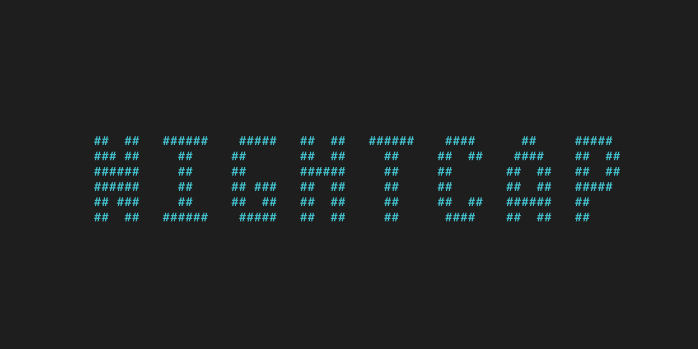

<span style="background:black">
<h1 align="center">
  <br>
  <a href="https://github.com/abaker2010/NightCAP"></a>
  <br>
  <br>
</h1>

[](https://www.python.org/downloads/release/python-373/)
[]()
[]()
[]()
[-yellow.svg>)]()
[](https://github.com/abaker2010/nightcap/wiki)
[](https://github.com/abaker2010/nightcap/blob/master/LICENSE)

[](https://www.buymeacoffee.com/abaker2010)

</br>

## Overview

```
  Nightcap is a comprehensive tool designed to simplify the usage, integration, and deployment
  of essential tools, regardless of your workflow. It eliminates the hassle of installing,
  updating, and using various tools, while offering a customized installation process that
  seamlessly configures your host environment to meet your package requirements.
  With Nightcap, you can easily set package parameters, and generate custom reports and
  reporting templates for all packages, including those that don't natively offer reporting options.
```

## Why Nightcap?

```
  Nightcap empowers you to build custom packages for any tool you may require, whether it's
  an existing tool on Github or a bespoke tool of your own. Our framework makes integration
  a breeze - all it takes is one file to seamlessly incorporate your tool into our platform.
```

## Multi Language Support

```
  Right out of the box you're able to start developing packages to integrate your favorite
  tools directly into our framework. With our multi language support the limitations of the
  new packages you can develop are endless.
```

### Current Languages Supported

- Python All Versions (Yes we mean all major, minor, and variants)
- Golan All Versions

---

</br>
</br>

## Additional Information

```
  To learn more about Nightcap and its capabilities, we encourage you to check out our Wiki.
  With Nightcap, you'll be able to hit the ground running on a powerful framework that
  will revolutionize the way you use your tools.
```

</br>
</br>

## Creator

Aaron Baker
</span>
